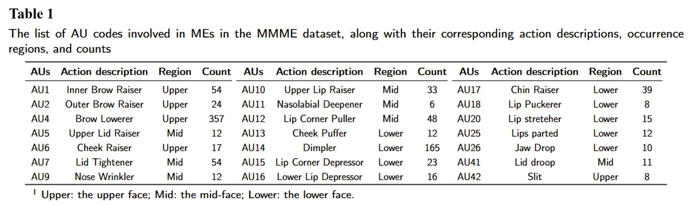
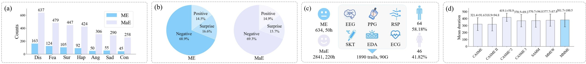
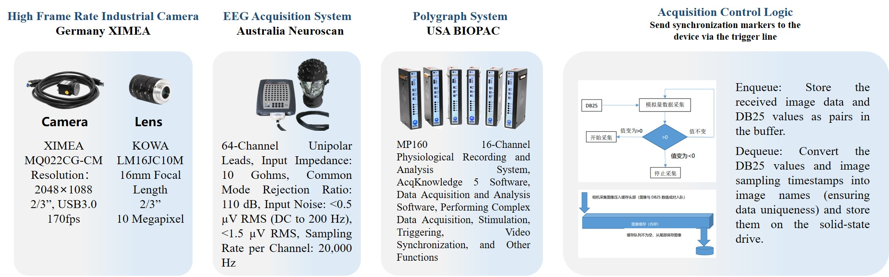
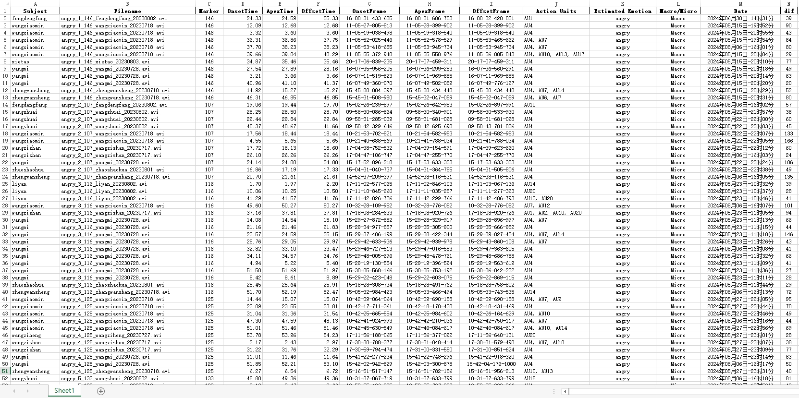

# MMME: A Spontaneous Multi-Modal Micro-Expression Dataset Enabling Visual-Physiological Fusion

# Abstract

Micro-expressions (MEs) are subtle, fleeting nonverbal cues that reveal an individual’s genuine emotional state. Their analysis has attracted considerable interest due to its promising applications in fields such as healthcare, criminal investigation, and human-computer interaction. However, existing ME research is limited to single visual modality, overlooking the rich emotional information conveyed by other physiological modalities, resulting in ME recognition and spotting performance far below practical application needs. Therefore, exploring the cross-modal association mechanism between ME visual features and physiological signals (PS), and developing a multimodal fusion framework, represents a pivotal step toward advancing ME analysis. This study introduces a novel ME dataset, MMME, which, for the first time, enables synchronized collection of facial action signals (MEs), central nervous system signals (EEG), and peripheral PS (PPG, RSP, SKT, EDA, and ECG). By overcoming the constraints of existing ME corpora, MMME comprises 634 MEs, 2,841 macro-expressions (MaEs), and 2,890 trials of synchronized multimodal PS, establishing a robust foundation for investigating ME neural mechanisms and conducting multimodal fusion-based analyses. Extensive experiments validate the dataset’s reliability and provide benchmarks for ME analysis, demonstrating that integrating MEs with PS significantly enhances recognition and spotting performance. To the best of our knowledge, MMME is the most comprehensive ME dataset to date in terms of modality diversity. It provides critical data support for exploring the neural mechanisms of MEs and uncovering the visual-physiological synergistic effects, driving a paradigm shift in ME research from single-modality visual analysis to multimodal fusion.

# Experimental setup and signal examples of the MMME dataset acquisition system

The experimental setup, as illustrated in the left panel of Fig. 1, was conducted in a controlled environment. To eliminate 50 Hz AC-induced flickering, we implemented a specialized lighting system consisting of three 600-watt DC-powered LED lights equipped with umbrella reflectors. These lights were strategically positioned to focus illumination on the participant's face, ensuring consistent and high-intensity lighting conditions. Specifically, the lighting configuration comprised one central light positioned directly in front of the participant and two additional lights placed at 45 angles to the left and right of the participant. Participants were seated one meter from the main display monitor, with a green background panel positioned behind them to facilitate subsequent facial image processing.

The list of AU codes involved in MEs in the MMME dataset, along with their corresponding action descriptions, occurrence regions, and counts is shown in Table 1.

In this section, we perform a statistical analysis of the annotated samples. The results, presented in Fig. 2, highlight four key characteristics: (a) the distribution of seven basic discrete emotions; (b) the distribution of three composite emotions (``Negative,'' ``Positive,'' and ``Surprise''); (c) the dataset size and participant gender composition; and (d) a comparison of mean ME durations and their standard deviations across benchmark datasets. 

# Samples of micro-expressions labeled with each emotion

The following animated images are samples of micro-expressions labeled with each emotion:

# Experimental equipment description

The Experimental equipment description and data synchronization mechanism are shown in the figure below:

# Data structure

The image below illustrates the data structure of a multimodal micro-expression dataset:

# Coding file

The dataset annotation file is shown in the figure below:

# How to Apply for the Dataset

To apply for this dataset, please download the "Release Agreement.pdf" file, print it, fill in the required information by hand, and send the scanned copy to the email address: ustb_machuang@163.com.
