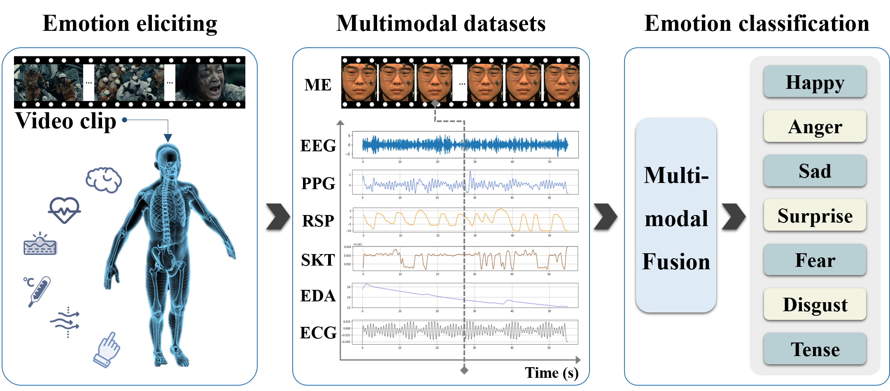
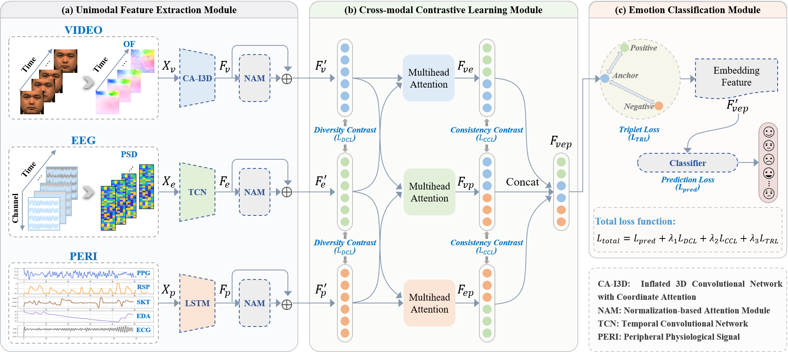
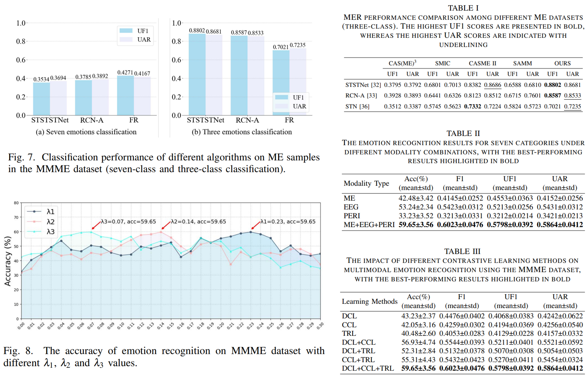

# Multi-modality Hidden Emotion Recognition via Electroencephalogram and Facial Micro-expressions

# Introduction

With the development of multimedia technology, emotion recognition has gradually matured, but hidden emotion recognition still faces numerous challenges. Given the unique advantages of micro-expressions (MEs) and electroencephalogram (EEG) signals in capturing subtle emotional cues, we recreated scenarios where individuals suppress facial expressions to conceal emotions in response to intense emotional stimuli. Simultaneous recording of MEs and EEG data from 67 participants resulted in a dataset comprising 453 ME video clips and 3,015 EEG trials across five emotional categories. To assess the dataset’s reliability, we developed an emotion classification model utilizing cross-modal attention mechanisms, achieving 80.46\% accuracy in classifying hidden emotions across the five categories. This method outperforms approaches relying solely on MEs or EEG by 9.83\% and 6.94\%, respectively. To the best of our knowledge, this is the first publicly available dataset that includes both MEs and EEG data, which will be available at: https://github.com/Mac0504/MEs-EEG.

# Samples

# Experimental Scene and Results

We simultaneously recorded facial videos and EEG data from 67 participants. Following meticulous annotation, we constructed a dataset comprising 453 micro-expression (ME) video clips and 3,015 EEG trials, covering five emotional categories.

The overview structure of our proposed MEs-EEG fusion and classification network has a dual-stream architecture and includes three components. 

Pipeline: (1) EEG feature extraction module. The EEG signals underwent preprocessing steps including downsampling, independent component analysis (ICA), and filtering. The resulting power spectral densities (PSDs) of five classical frequency bands were fed into a Temporal Convolutional Network (TCN) to extract advanced features, as shown in (a). 

(2) For ME samples, the optical flow between the onset and apex frames was computed. A Spatial Transformer Network (STN) was then employed to extract visual features from key facial regions, as shown in (b). 

(3) Transformer-based fusion and classification module. A fusion and classification model leveraging cross-modal attention was developed to facilitate information exchange between the two modalities via a Cross-Transformer. To address the issue of class imbalance in hidden emotion classification, the focal loss function was applied, as shown in (c).

We found that the integration of EEG and ME features significantly enhances emotion classification accuracy, demonstrating the effectiveness of the multi-modality fusion strategy employed in this study. This finding suggests a degree of complementarity between the two modalities in representing different emotions. Additionally, regardless of whether a single-modality or multi-modality approach is utilized, the trained models exhibit the best performance in classifying disgust and fear, achieving accuracy rates of 85.51\% for disgust and 79.29\% for fear. This result can be partly attributed to the relatively large sample sizes for these two emotions. Additionally, disgust and fear exhibit significant differences in physiological responses and facial expressions, which further contribute to the model's enhanced performance in classifying these negative emotions.

# How to get

This database is publicly available for any academic use. To obtain it, please sign the release agreement and send a scanned copy to ustb_machuang@163.com.
