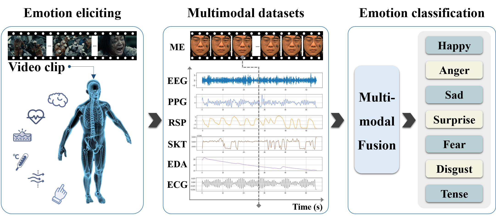
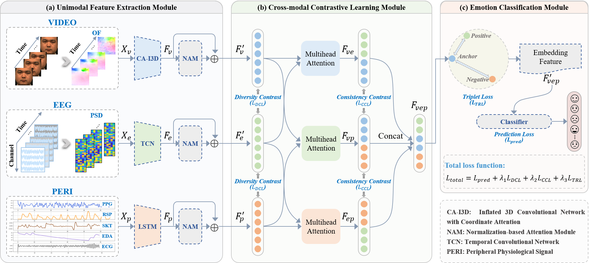
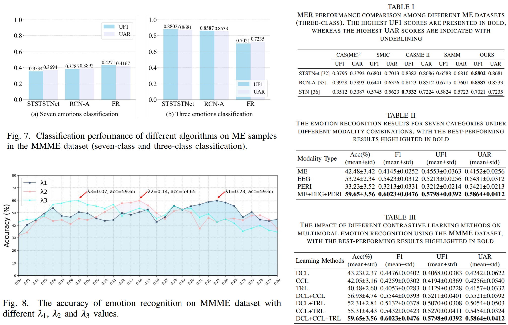

# Unveiling Genuine Emotions: Integrating Micro-Expressions and Physiological Signals for Enhanced Emotion Recognition

# Introduction

In recent years, multimodal emotion recognition has attracted growing interest due to its potential to improve emotion classification accuracy by integrating information from diverse modalities. This study replicates a scenario in which individuals suppress facial expressions to conceal emotions under intense emotional stimuli, while simultaneously recording micro-expressions (MEs), electroencephalograms (EEG), and peripheral physiological data (PERI) from 75 participants. The resulting multimodal dataset consists of 634 ME video clips across seven emotional categories, as well as 4,200 trials of physiological signals (PS). To assess the dataset’s reliability, we establish a cross-modal contrastive learning framework that incorporates diversity contrastive learning, consistency contrastive learning, and sample-level contrastive learning, designed to capture complementary features across different modalities. Experimental results confirm that multimodal fusion significantly enhances emotion classification accuracy. This study not only offers a solution for emotion analysis but also contributes to understanding the relationship between MEs and PS, along with their underlying mechanisms. To the best of our knowledge, this is the first multimodal emotion dataset that simultaneously collects MEs, EEG, and PERI.

# Samples

# Experimental Scene and Results

The resulting multimodal dataset consists of 634 ME video clips across seven emotional categories, as well as 4,200 trials of physiological signals (PS).

The overall architecture of the model is shown in the figure below, which adopts a three-stream structure comprising three key components. The detailed process is described as follows. 

Pipeline: 

(i) Unimodal Feature Extraction Module: Given the distinct characteristics of different modalities, we design dedicated feature extractors to efficiently capture the spatiotemporal features of each modality. Specifically, CAI3D is employed for video data processing, TCN is used for EEG signals, and LSTM is responsible for extracting features from PERI signals. To further enhance the representational capacity of unimodal features, we incorporate the NAM residual attention module, enabling adaptive feature selection and enhancement. 

(ii) Cross-Modal Contrastive Learning Module: The extracted features are first fed into a multi-head mutual attention module to achieve deep crossmodal fusion and facilitate information exchange between modalities. Building upon this, we develop a diversity contrastive learning mechanism to enhance the complementarity of cross-modal features, alongside a consistency contrastive learning strategy to ensure semantic-level alignment and coherence across different modalities. 

(iii) Emotion Classification Module: The fused feature representations are input into a triplet network to optimize the feature embedding space, thereby improving the discriminability of emotional states. Finally, the model is trained using a crossentropy loss function as the optimization objective to guide the emotion recognition task.

After preprocessing and feature extraction of MEs, we employed several typical MER algorithms, including STSTNet, RCN-A, and FR, and conducted experiments on multiple publicly available ME datasets, such as SMIC, CASEM II, SAMM, and CAS(ME)3 , as well as our constructed MMME dataset. During the evaluation, we used two metrics from the MER task in MEGC2019: Unweighted Average Recall (UAR) and Unweighted F1 score (UF1), along with Leave-One-Out Cross-Validation (LOSOCV) for model validation. The classification tasks included the recognition of seven discrete emotions and a three-class classification (i.e., positive, negative, and surprise). Fig. 7 illustrates the classification performance of three representative MER models on the MMME dataset. These models achieve an average UAR of 0.3918 and an average UF1 of 0.3863 for the seven-class classification task. In the three-class classification task, the average UAR and UF1 are 0.8150 and 0.8137, respectively. These results highlight the strong discriminative power of our ME samples. Table I further compares the threeclass classification performance of these algorithms on both public ME datasets and the MMME dataset. The findings show that all three algorithms achieve either optimal or nearoptimal performance on the MMME dataset, thereby confirming the validity of the ME samples we have collected.

